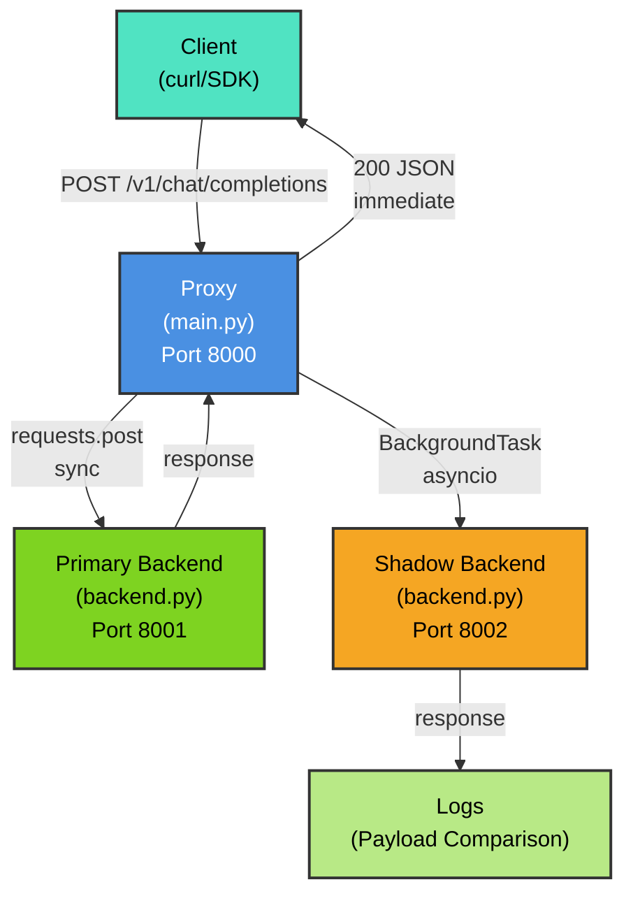

# LLM Proxy Architecture

## System Diagram

```mermaid
graph TB
    Client["Client<br/>(curl/SDK)"]
    
    Proxy["Proxy<br/>(main.py)<br/>Port 8000"]
    
    Primary["Primary Backend<br/>(backend.py)<br/>Port 8001"]
    Shadow["Shadow Backend<br/>(backend.py)<br/>Port 8002"]
    
    Logs["Logs<br/>(Payload Comparison)"]
    
    Client -->|POST /v1/chat/completions| Proxy
    
    Proxy -->|requests.post<br/>sync| Primary
    Primary -->|response| Proxy
    Proxy -->|200 JSON<br/>immediate| Client
    
    Proxy -->|BackgroundTask<br/>asyncio| Shadow
    Shadow -->|response| Logs
    
    style Proxy fill:#4A90E2,stroke:#333,stroke-width:2px,color:#fff
    style Primary fill:#7ED321,stroke:#333,stroke-width:2px,color:#000
    style Shadow fill:#F5A623,stroke:#333,stroke-width:2px,color:#000
    style Client fill:#50E3C2,stroke:#333,stroke-width:2px,color:#000
    style Logs fill:#B8E986,stroke:#333,stroke-width:2px,color:#000
```
